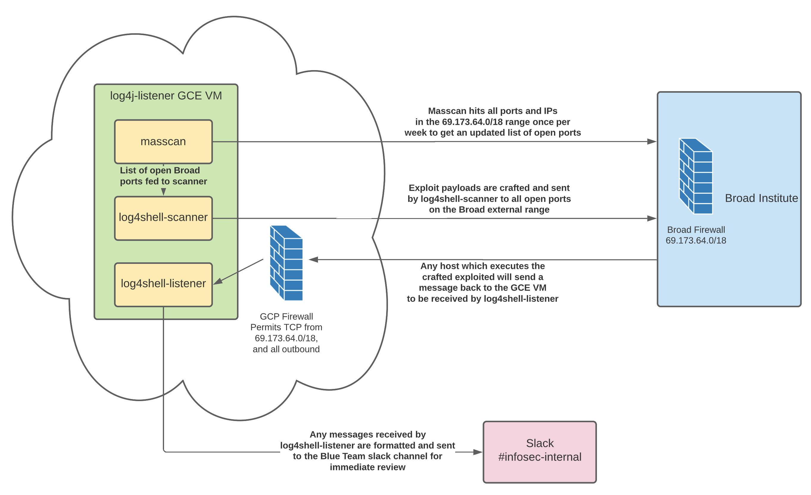

# Broad log4shell Web Server Scan Tool

> [!NOTE]
> This repository has been made public as the tool is no longer in use by the security team, and was primarily used as an intial assessment of our exposure in the immediate aftermath of the log4shell vulnerability disclosure.

## Architecture


[link to latest version](https://lucid.app/lucidchart/434ccfcc-eb3b-4b82-b40c-f9f1a943cfc0/edit?viewport_loc=15%2C41%2C1790%2C1170%2C0_0&invitationId=inv_4c1416c8-da36-4a95-8337-c59e8cb457da)

## Usage

### Requirements

#### Pre-requirements

- **Debian OR RHEL8**
  - Tested on Debian 10 (buster), Debian 11 (bullseye), and RHEL 8.
  - May work on other Linux distros but may also break things. So for now the install script will refuse to install on a non-Debian/RHEL system.
- **Debian only: sudo privileges**
- [Python3](https://www.python.org/downloads/)
  - Tested on 3.8, 3.9, and 3.10. Will **not** be automatically installed and will terminate the install process if it is not present.
  - Be sure to adjust the pythonpath in `install.rhel.conf` if needed.

#### Other Requirements

- [masscan](https://github.com/robertdavidgraham/masscan)
  - Will install it if it is not present.

### Get

```
$ wget --header "Authorization: token ${GITHUB_ACCESS_TOKEN}" 'https://github.com/broadinstitute/bits-bt-scan-log4shell/archive/refs/tags/{RELEASE_TAG}.tar.gz' -O /tmp/log4shell.tar.gz
$ tar -xvf /tmp/log4shell.tar.gz -C /local/src
```

### Setup

- Installation sets up three main tasks:
  - [masscan](https://github.com/robertdavidgraham/masscan):
    - Installs if it is not present.
    - Adds cronjob to executing user's crontab.
  - Scanner:
    - Installs Python requirements.
    - Adds cronjob to executing user's crontab.
  - Listener:
    - Installs Python requirements.
    - Restarts the service.

```bash
$ cd /local/src/bits-bt-scan-log4shell-{RELEASE_TAG}/log4shell-scan
# Make any necessary changes to install.conf and the two additional config files listed below.
$ vim install.rhel.conf
$ vim scanner/config.ini
$ vim listener/config.ini
$ chmod +x *.sh
$ ./install.rhel.sh
```

### Configure

- Configure the install in [install.rhel.conf](./log4shell-scan/install.rhel.conf).
  - Must be done before running `./install.rhel.sh`.
- Configure the scan script in [config.ini](./log4shell-scan/scanner/config.ini).
  - May be done after install, the scanner will grab the latest config the next time it runs.
- Configure the listener in [config.ini](./log4shell-scan/listener/config.ini).
  - May be done after install, however _requires a restart to the listener system service_ (`sudo systemctl restart log4shell-listen.service`).

### Uninstall

```bash
$ cd /local/src/bits-bt-scan-log4shell-{RELEASE_TAG}/log4shell-scan
$ ./uninstall.sh
```
